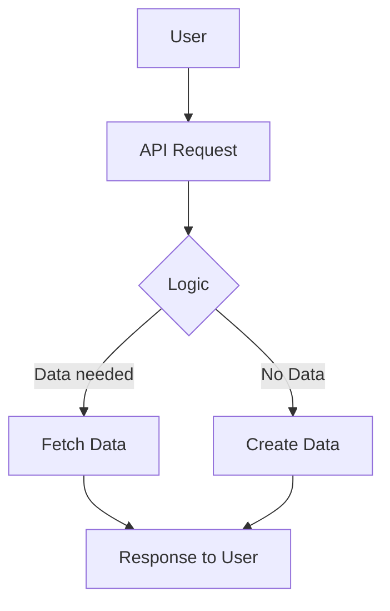

# Architecture of the FSO System

The Functional System Overview (FSO) is designed to provide a comprehensive look at the architecture and flow of the system. Below are diagrams and explanations that detail how different components interact with one another.

## System Architecture Diagram

```
      +------------------+
      |    User Input    | 
      +--------+---------+
               |  
               v  
      +------------------+
      |      API         | 
      +--------+---------+
               |  
               v  
      +------------------+
      |  Business Logic   | 
      +--------+---------+
               |  
               v  
      +------------------+
      |     Database      | 
      +------------------+
```  

## Flow Chart for User Interaction



## Explanation

### System Architecture Diagram:
- **User Input:** This is where the interaction starts, capturing user input for processing.
- **API:** The API acts as the gateway for users, allowing access to the business logic and database.
- **Business Logic:** This layer contains the core functionalities and decision-making processes of the system.
- **Database:** This is where all the data is stored, retrieved, and managed.

### Flow Chart for User Interaction:
- **User:** This block represents the user initiating the request.
- **API Request:** The user's request is sent to the API.
- **Logic:** The system evaluates what kind of response is needed based on user input.
- **Fetch Data/Create Data:** Logic determines whether to fetch existing data or create new data based on the API request.
- **Response to User:** The final output is sent back to the user in a structured format.