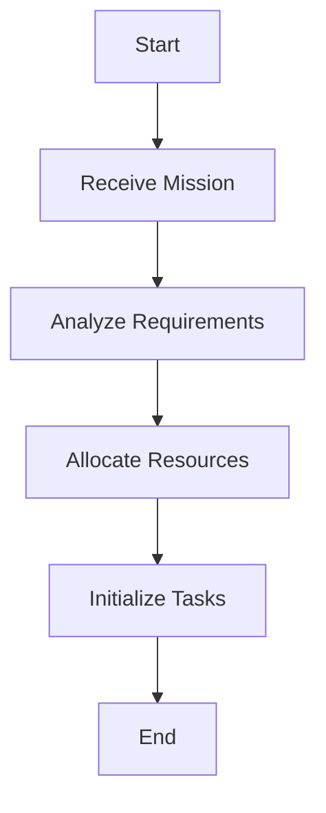
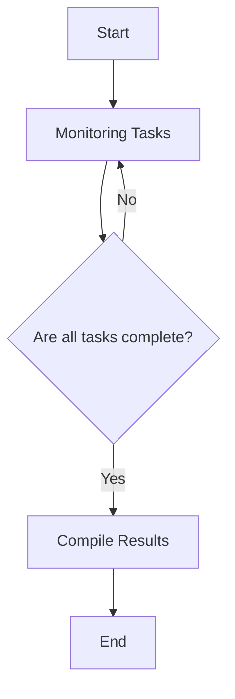

# FSO Architecture Documentation

## Overview
This document outlines the architecture of the FSO (Future State Orchestrator) system, which is comprised of several components that work together to execute complex missions seamlessly.

### Components

1. **Sovereign Orchestrator**  
   The main control unit of the FSO architecture, responsible for high-level decision making and orchestration of various subsystems.

2. **TGI Engine**  
   The core processing engine that handles task generation and management, ensuring optimal resource allocation.

3. **Codex Grid**  
   A distributed knowledge base that stores and retrieves relevant information needed for mission execution.

4. **Vision Processor**  
   Component dedicated to analyzing visual inputs from various sensors, using advanced algorithms for object recognition and environment mapping.

5. **Parity Vault**  
   A secure storage system that holds critical data and state information, ensuring data integrity and security throughout operations.

6. **Topological Reasoner**  
   This component allows the system to make logical inferences about the relationships and configurations of entities within the operational environment.

### Mission Execution Flows
The mission execution is divided into several flows to manage the complexity effectively. Below are the flows visualized with ASCII diagrams and mermaid flowcharts.

#### Flow 1: Task Initiation


##### ASCII Diagram:
```
   +-------+    +------------------+    +------------------+
   | Start | -> | Receive Mission   | -> | Analyze Requirements |
   +-------+    +------------------+    +------------------+
                          |                           |
                          v                           v
                    +------------------+    +------------------+
                    | Allocate Resources | -> | Initialize Tasks   |
                    +------------------+    +------------------+
                          |                           |
                          v                           v
                       +-------+                    +-------+
                       | End   | <----------------- | End   |
                       +-------+                    +-------+
```

#### Flow 2: Execution Monitoring


##### ASCII Diagram:
```
   +-------+    +-----------------+  +--------------------+
   | Start | -> | Monitoring Tasks | --> |   Are all tasks complete?   |
   +-------+    +-----------------+  +--------------------+
                   | No  | Yes
                   v      v
             +-----------------+     +------------------+
             | Monitor Next Task |--->| Compile Results    |
             +-----------------+     +------------------+
                                              |      
                                              v      
                                          +-------+  
                                          | End   |  
                                          +-------+  
```

### Conclusion
The FSO architecture is designed to ensure robust, secure, and efficient execution of diverse and complex missions. Each component plays a vital role in overall functionality, and the interaction between them allows for high levels of adaptability and responsiveness to changing operational requirements.